## 关于AWS Cloud9

[AWS Cloud9](https://aws.amazon.com/cn/cloud9/?nc1=h_ls) 是一种基于云的集成开发环境 (IDE)，您只需要一个浏览器，即可编写、运行和调试代码。它包括一个代码编辑器、调试程序和终端。Cloud9 预封装了适用于 JavaScript、Python、PHP 等常见编程语言的基本工具，您无需安装文件或配置开发计算机，即可开始新的项目。Cloud9 IDE 基于云，因此您可以从办公室、家中或任何地方使用已连接互联网的计算机完成项目。Cloud9 还可以为开发无服务器应用程序提供无缝体验，使您能够轻松定义资源、进行调试，并在本地和远程执行无服务器应用程序之间来回切换。借助 Cloud9，您可以与团队快速共享开发环境，从而能够将程序配对，并实时跟踪彼此的输入。

## 在AWS国内区域通过 Marketplace 部署 Cloud9 Web IDE
目前AWS Cloud9暂未落地在中国区域, 因此无法在控制台上直接启动一个Cloud9 IDE. 不过由于[Cloud9 Core](https://github.com/c9/core)是开源的，因此我们可以通过在EC2上部署Cloud9 Core来达到使用Cloud9 IDE的目的。

目前这个AMI已经经过了Marketplace的流程并上线，中国区的用户可以在启动EC2的时候，选择Marketplace中的AMI创建一台虚拟机即可。Cloud9相关的Web服务会自动在EC2里面启动，相关的安全组也会配置好。以下是具体的在AWS中国区控制台的操作步骤：

#### 1. Marketplace中选择AMI

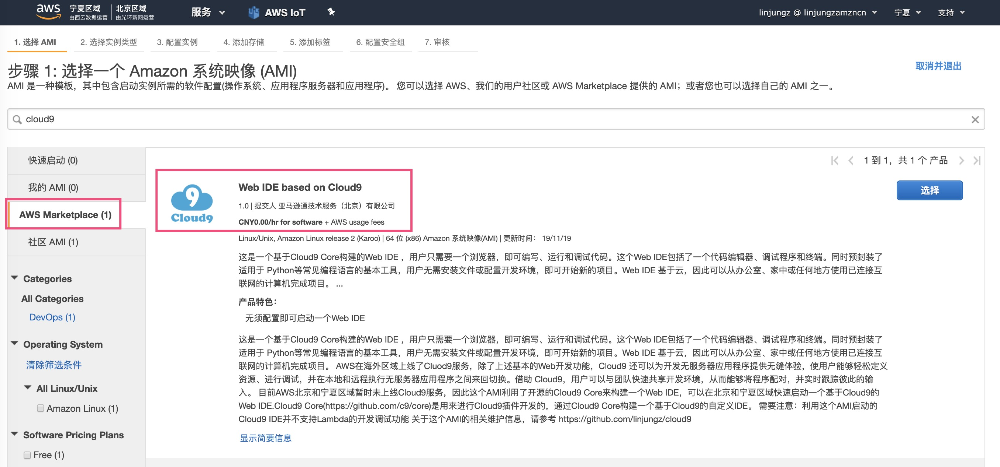

#### 2. 了解AMI相关信息

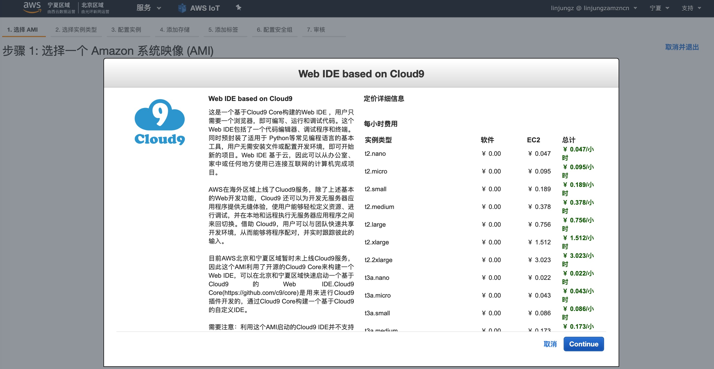
点击"Continue"继续下一步

#### 3. 选择实例类型

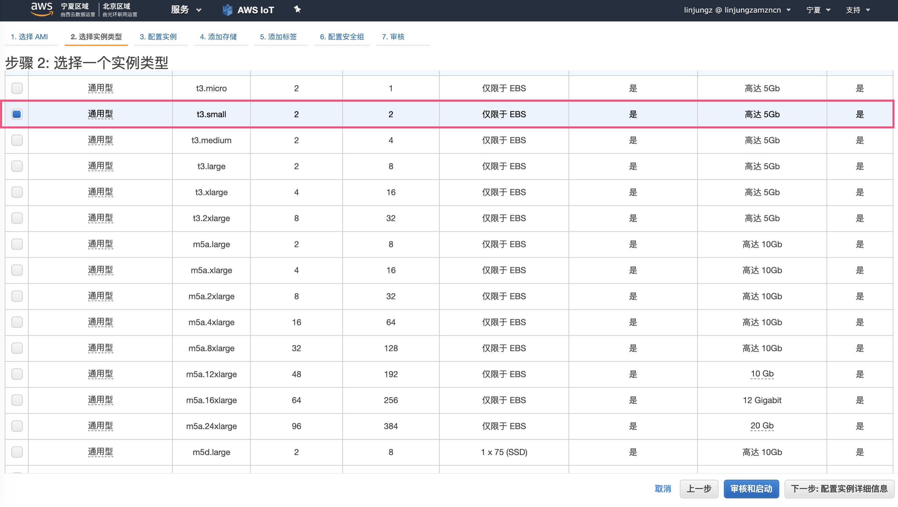
可以选择默认的t3.small类型，或是根据需要选择配置更高的实例类型

#### 4. 配置实例

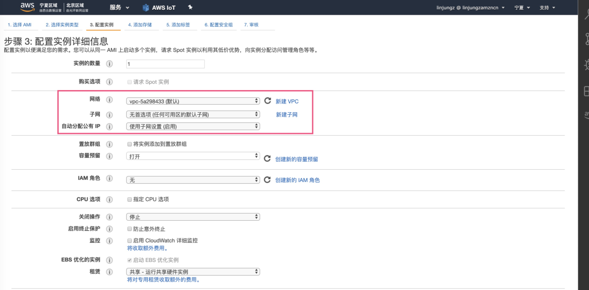
对实例的信息进行配置。注意网络相关的配置，需要确保选择一个可通公网的子网，并分配公有IP，以便从互联网访问EC2实例

#### 5. 配置存储

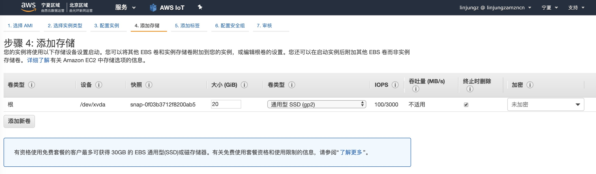
可以按默认配置，或是根据需要增加存储卷数量或大小

#### 6. 配置标签

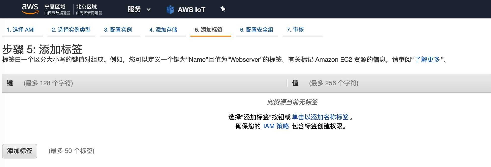
可以根据需要为实例进行标签配置

#### 7. 配置安全组

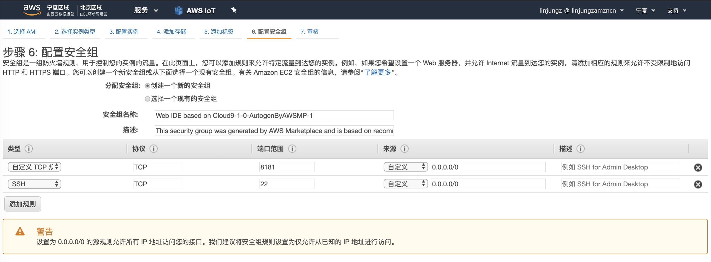
针对这个AMI会默认打开8181端口和22端口。其中8181端口做为Cloud9 Web IDE的访问端口（必须），22端口是做为SSH远程访问端口（非必须）。

#### 8. 审核并启动实例

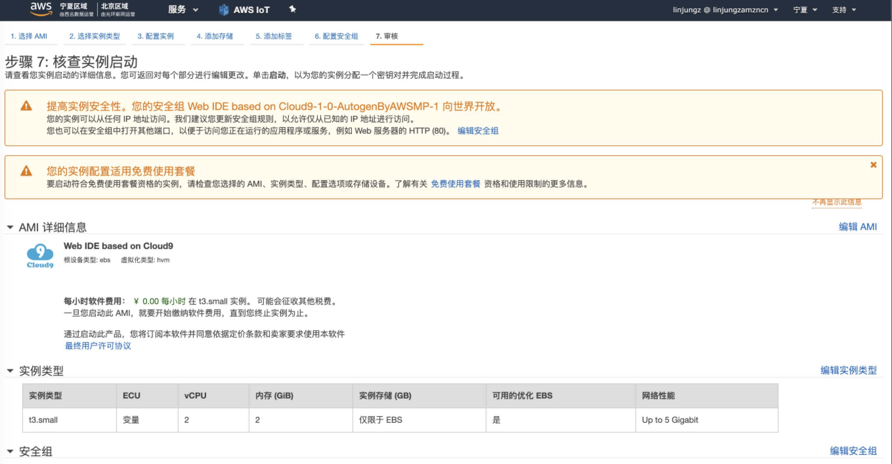
相关配置信息检查无误后即可启动实例

#### 9. 配置SSH Key

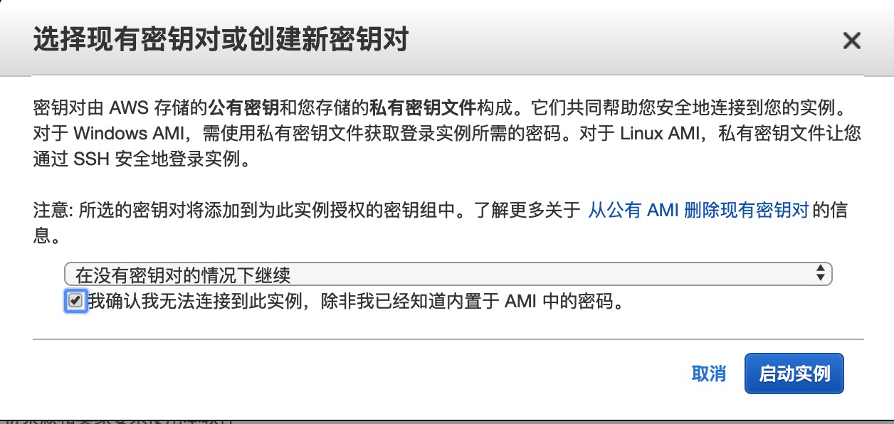
一般使用这个AMI无须配置SSH Key, 只需要通过Web来登陆即可。如果后续希望通过SSH登陆这台EC2，则可以配置SSH Key

#### 10. 查看实例启动状态

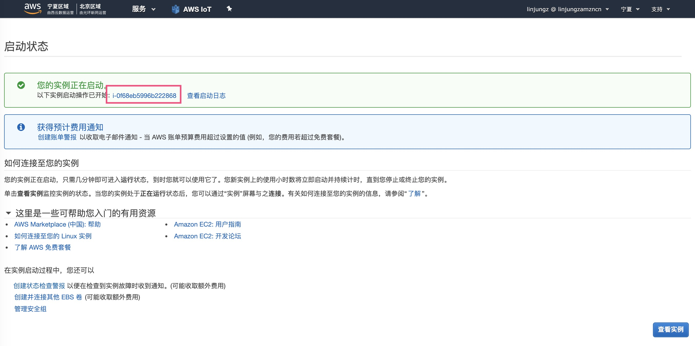
此时实例已经正常启动，点击红色框中的实例ID可以查看实例的相关信息

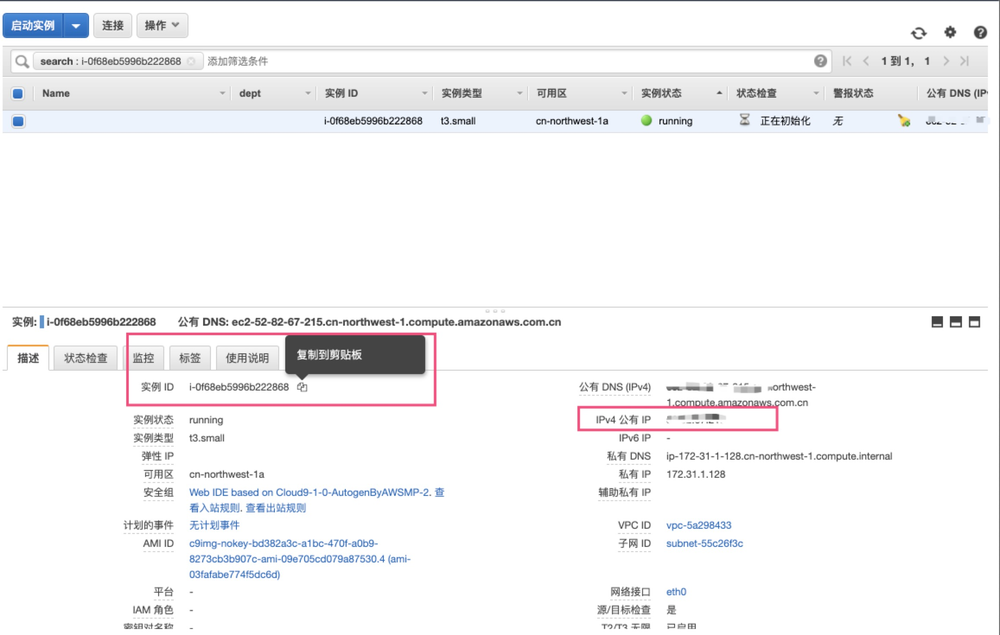
留意在这个窗口下可以查看到实例的ID和实例的公有IP/DNS，后续登陆Cloud9时需要用到

#### 11. 登陆Cloud9

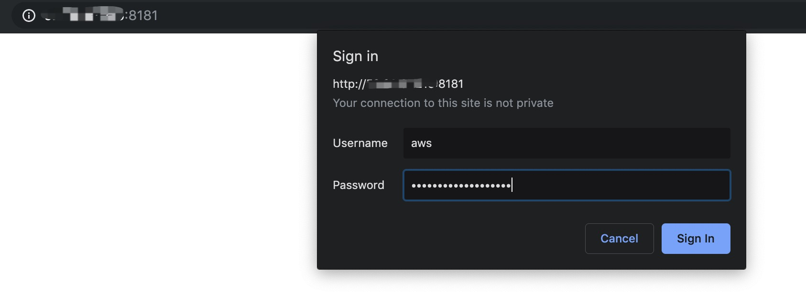
在浏览器中输入 http://实例公有IP:8181 ，并在弹出的窗口中输入
- 用户名： aws
- 密码： 实例ID（即上一个步骤中获取到的实例ID）

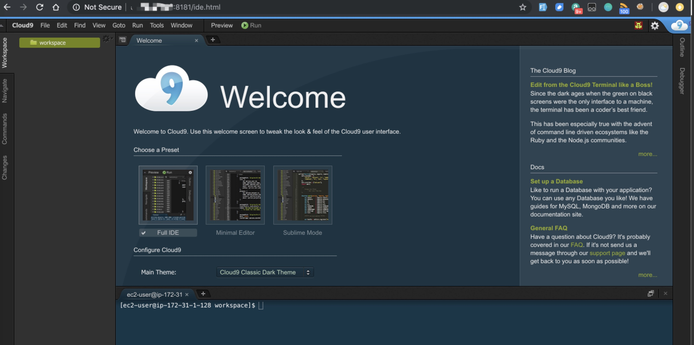
验证成功后即可登陆至Cloud9 Web IDE